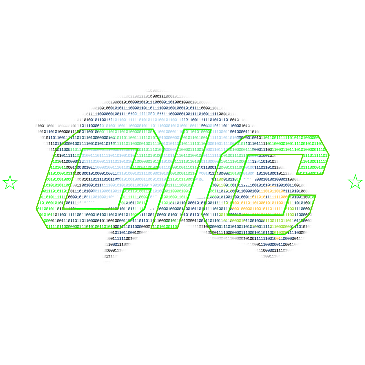

[](https://github.com/cic-rwu/cic-rwu/issues)
[](https://www.gnu.org/licenses/gpl-3.0.txt)
[](https://github.com/cic-rwu/cic-rwu/commits/main)

<p align="center">
  
  <!-- Replace docs/banner.png with the club logo/banner -->
</p>

>This repo is still a work in progress! If you have suggestions, please see [Contact](#contact) to send us an email, or submit an [issue](https://github.com/cic-rwu/cic-rwu/issues) on Github!

# cic-rwu

**Umbrella repository for the Roger Williams University Cybersecurity and Intel Club.**

Every club project is starts here. Demos, tools, and experiments start as a folder in this repo; once a project outgrows the umbrella, it gets forked into its own standalone repository under the [cic-rwu](https://github.com/cic-rwu) org.

## Table of Contents

- [About](#about)
- [Repo Structure](#repo-structure)
- [Getting Started](#getting-started)
- [Get Involved](#get-involved)
- [Contact](#contact)
- [License](#license)

## About

The Cybersecurity and Intel Club (CIC) at RWU is a student organization for anyone interested in security, offensive/defensive tooling, CTFs, and intelligence analysis. This repo is our shared workspace: a place for members to prototype, collaborate, and graduate ideas into full projects.

- Club page: [HawkLink](https://hawklink.rwu.edu/organization/cybersecurity-intel)
- Org: [github.com/cic-rwu](https://github.com/cic-rwu)

## Repo Structure
```
cic-rwu/
├── bin/        # Shared shell scripts used across club projects
└── README.md
```

- **`bin/`** — Shared shell scripts (setup, tooling, utilities) reused across multiple club projects. If you're writing a script more than one project will need, it belongs here rather than duplicated per-project.

As individual projects mature, they're extracted into their own repo in the [cic-rwu org](https://github.com/orgs/cic-rwu/repositories) and linked back here.

## Getting Started

1. Clone the repo:
   ```
   git clone https://github.com/cic-rwu/cic-rwu.git
   cd cic-rwu
   ```
2. Source or run scripts from `bin/` as needed for your project setup.
3. Starting something new? Add it as a new top-level folder. Open an issue or bring it to a meeting first if you want feedback on scope/direction.

## Get Involved

New members are always welcome, no experience required.

- Join via [HawkLink](https://hawklink.rwu.edu/organization/cybersecurity-intel)
- Browse [open issues](https://github.com/cic-rwu/cic-rwu/issues) for project ideas to jump into
- Ask in a meeting or email us (below) about access to the org

## Contact

- Email: [cic@g.rwu.edu](mailto:cic@g.rwu.edu)
- HawkLink: [hawklink.rwu.edu/organization/cybersecurity-intel](https://hawklink.rwu.edu/organization/cybersecurity-intel)

## License

Distributed under the [GPLv3](LICENSE).
