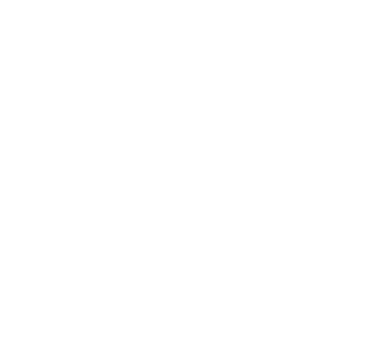

<div align="center">

[](https://github.com/cic-rwu/cic-rwu/blob/main/LICENSE)
[](https://github.com/cic-rwu/cic-rwu/issues)


<div style="display: flex;flex-direction:column;align-items:flex-start;">


</div>
</div>
<p align="center">
  
</p>

<div>
<style>
  h1{
    text-align:center;
    border-bottom:none; !important
    text-decoration:none; !important
    padding:none; !important
    font-family: sans-serif;
  font-weight: 550;
  font-style: normal;
  }
  h3,h5 {
    margin-top:-10px;
    text-align:center;
    font-weight:400;
    opacity:0.7;
    padding:none; !important
  }
</style>
<h1>CYBERSECURITY AND INTEL CLUB</h1>
<h3>ROGER WILLIAMS UNIVERSITY</h3>
</div>

## Table of Contents

- [About](#about)
- [Repositories](#repo-structure)
- [Getting Started](#getting-started)
- [Get Involved](#get-involved)
- [Contact](#contact)
- [License](#license)

## About

Welcome to the Github organization for [Roger Williams University](https://rwu.edu)'s Cybersecurity and Intel Club!

We are a student-run club based in Bristol, Rhode Island, that meets weekly to discuss cyber news, attend professional conferences (DEFCON, Hackfest, etc.,) as well as present bi-weekly hands-on demonstrations!

If you're looking for code we've written, or more technical documentation in general, see the [repository](https://github.com/cic-rwu/cic-rwu).

## Getting Started

1. Clone the repo:
   ```
   git clone https://github.com/cic-rwu/cic-rwu.git
   cd cic-rwu
   ```
2. Source or run scripts from `bin/` as needed for your project setup.
3. Starting something new? Add it as a new top-level folder. Open an issue or bring it to a meeting first if you want feedback on scope/direction.

## Get Involved

New members are always welcome, no experience required.

- Join via [HawkLink](https://hawklink.rwu.edu/organization/cybersecurity-intel)
- Browse [open issues](https://github.com/cic-rwu/cic-rwu/issues) for project ideas to jump into
- Ask in a meeting or email us (below) about access to the org

## Contact

- Email: [cic@g.rwu.edu](mailto:cic@g.rwu.edu)
- HawkLink: [hawklink.rwu.edu/organization/cybersecurity-intel](https://hawklink.rwu.edu/organization/cybersecurity-intel)

## License

Distributed under the [GPLv3](LICENSE).
